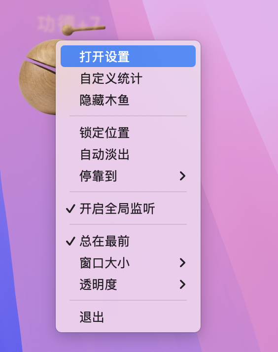
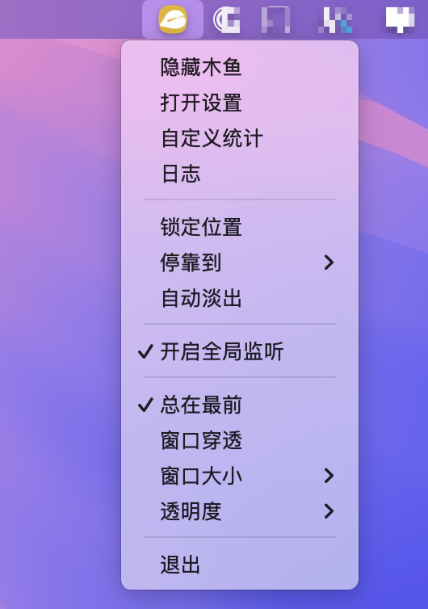
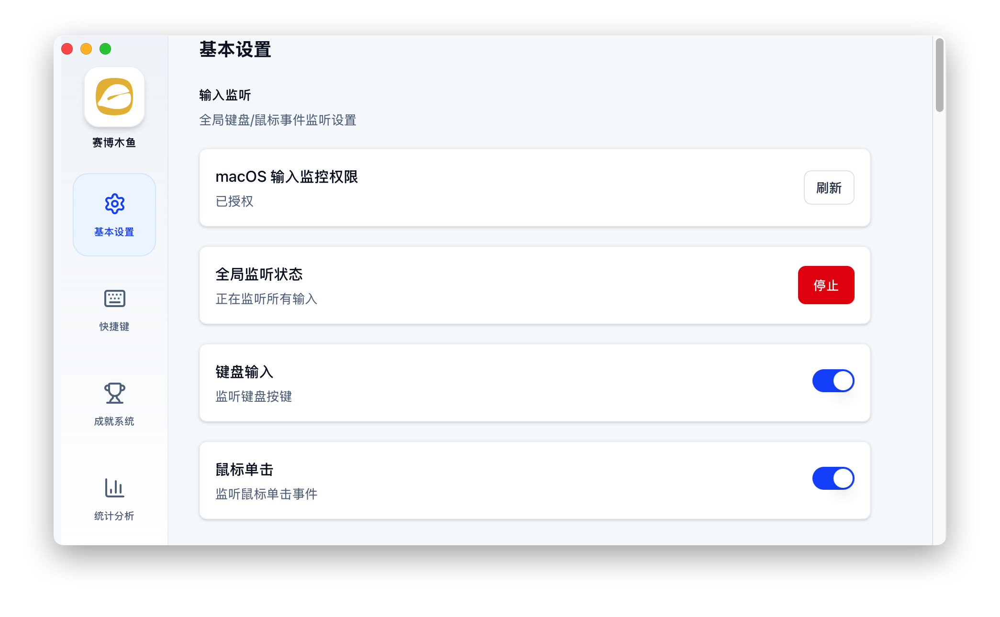
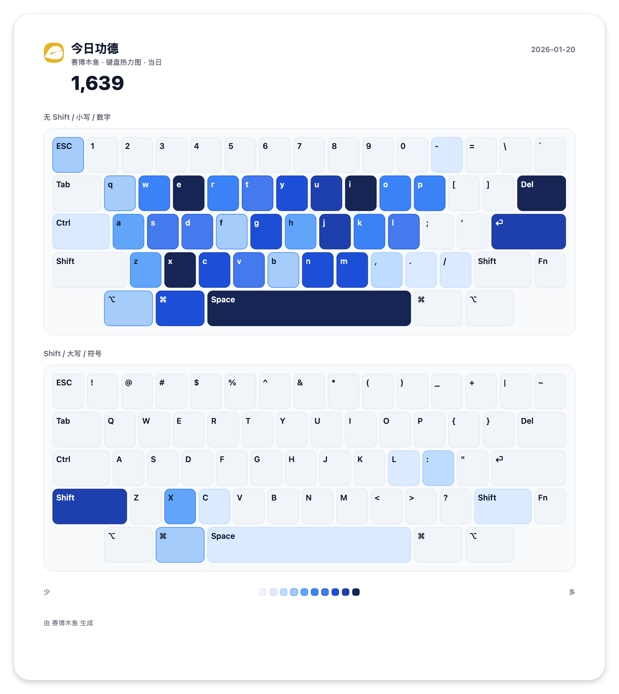

<div align="center">
  
  <h1>CyberZen（赛博木鱼）</h1>
  <p>一个基于 <a href="https://tauri.app/">Tauri 2</a> + React + Vite 的桌面悬浮「木鱼」应用：点一下加功德，也可以用全局快捷键/全局监听把“日常键鼠操作”变成可视化统计。</p>
</div>

## 这是什么

CyberZen 的核心是一枚常驻桌面的「悬浮木鱼」窗口：

- 你可以直接点击木鱼积攒功德（带动画与飘字）。
- 也可以开启全局监听（键盘/鼠标），把你在系统里发生的输入事件计入功德，并生成一套统计面板（键盘热力图、应用排行、时间分布等）。
- 所有数据默认仅保留在本地：它更像一个“自用的桌面小玩具 + 输入习惯看板”，而不是需要联网的服务。

## 功能与界面（详细）

### 1) 主悬浮窗（木鱼）

- 透明/无边框/置顶：更像桌面摆件，可随时隐藏/显示。
- 点击交互：左键敲木鱼（计数 + 动画 + 飘字），拖拽移动位置。
- 防误触体验：
  - 锁定位置（禁止拖动）
  - 拖动长按（按住一会儿才进入拖动，避免点着点着把窗口拖走）
  - 角落停靠（快速吸附到四个角落，可配置边距）
  - 自动淡出（空闲后降低透明度，鼠标靠近/交互时恢复）
- 右键快捷菜单：在木鱼上右键即可快速开关常用选项（见下方“快捷菜单/托盘菜单”）。

### 2) 系统托盘与右键快捷菜单

无需打开设置页，也能完成绝大多数常用操作：

- 显示/隐藏木鱼
- 打开设置 / 打开自定义统计 / 打开日志
- 锁定位置、自动淡出、角落停靠
- 开关全局监听
- 置顶、窗口穿透（Click-through）
- 窗口缩放（50%～150%）、透明度（30%～100%）

### 3) 设置窗口（侧边栏 Tab）

设置窗口是“总控台”，大致分为以下模块（实际 UI 以版本为准）：

- 通用（General）
  - 全局监听状态与权限提示（尤其是 macOS 的「输入监控」授权）
  - 监听项开关：键盘计数 / 鼠标点击计数
  - 鼠标移动距离：校准不同显示器的 DPI/尺寸，让“移动距离”统计更接近真实使用感
  - 窗口：锁定位置、穿透、置顶、停靠边距、缩放、透明度、自动淡出参数、拖动长按等
  - 外观：木鱼皮肤、木鱼透明度、动画速度、飘字（功德）文字与透明度等
  - 应用：语言（`system/en/zh-CN/zh-TW`）、开机自启、是否显示任务栏图标、成就通知等
- 快捷键（Shortcuts）
  - 录制并注册全局快捷键：显示/隐藏木鱼、打开设置、开关全局监听、切换置顶/穿透、打开/关闭自定义统计等
- 成就（Achievements）
  - 按天/周/月/年/总计维度解锁成就（并可查看解锁历史）
  - 支持系统通知（需系统授权，是否可用依平台而定）
- 统计（Statistics）
  - 历史功德、输入来源分布、按小时/按星期分布、键盘热力图、鼠标按钮热力图、应用输入排行等
  - 部分统计支持“分享/导出”形态的展示（例如键盘热力图的分享视图）
- 关于（About）
  - 版本信息、开源地址、检查更新/下载安装更新（如启用 Updater）
  - 也可以从这里快速打开数据目录

### 4) 自定义统计窗口（Custom Statistics）

这是一个“可定制的看板窗口”，适合当作第二屏/侧边栏常驻：

- 勾选要显示的统计模块，并支持排序（上移/下移）。
- 统计范围可切换：仅今日 / 累计历史（依模块而定）。
- 可从托盘/右键菜单/快捷键快速打开。

内置模块示例（按版本可能增减）：

- 趋势、日历热力图（历史功德日历）
- 键盘热力图/按键排行/快捷键列表
- 鼠标按钮热力图/点击位置热力图/鼠标移动距离
- 时间分布（按小时、按星期、小时×星期热力图）
- 应用排行/专注度、输入来源占比、洞察（Insights）等

### 5) 日志窗口（Logs）

用于排查问题与自查行为：

- 查看最近日志记录（可搜索、可清空）
- 一键打开日志目录

## 界面预览







## 使用指南（从“装好就用”到“玩出花”）

### 快速上手

1. 启动后会出现主悬浮木鱼窗口（默认置顶、默认不显示任务栏图标）。
2. 直接点击木鱼积攒功德。
3. 在木鱼上右键打开快捷菜单：隐藏/显示、置顶/穿透、缩放/透明度、打开设置/统计等。
4. 需要把“键盘/鼠标操作也算功德”时：去设置里开启全局监听，并根据系统提示授予权限。

### “窗口穿透”适合什么场景？

开启后木鱼不再拦截鼠标点击（点得到它下面的窗口），适合把木鱼当作纯摆件或角落小组件；需要敲木鱼时可以用快捷键临时关闭穿透，或者从托盘菜单切换。

### “自动淡出”怎么用更舒服？

推荐把主透明度设为 90%～100%，空闲透明度设为 20%～40%，延迟 0.8s～1.5s：不影响注意力，但需要时仍能快速定位。

## macOS 权限说明（全局监听）

当你开启“全局监听”或启用键盘/鼠标触发时，macOS 需要授予应用「输入监控」权限：

`系统设置 -> 隐私与安全性 -> 输入监控 -> CyberZen`

若已授权但仍不生效：可在该列表中移除应用后重新添加，并重启应用。

## 数据与隐私

### 数据存哪儿？

应用数据存储在 Tauri 的 `appDataDir` 下（设置页可直接打开数据目录）。常见路径示例：

- macOS：`~/Library/Application Support/com.littleq.cyberzen/`
- Windows：`%APPDATA%\\com.littleq.cyberzen\\`
- Linux：`~/.local/share/com.littleq.cyberzen/`

默认会在该目录下保存 `state.json`（包含设置、功德统计、窗口位置、部分统计数据等）。

### 会记录什么？不会记录什么？

- 会：键盘按键“次数/键位分布”、鼠标按键次数、鼠标移动距离、点击位置热力图（以网格聚合）、按应用的输入计数、功德累计与历史日统计等。
- 不会：你输入的文本内容、剪贴板内容、屏幕内容、网络账号信息等。
- 默认不上传：本项目无遥测/埋点上报逻辑，数据默认仅在本地保存。
- 可能的网络访问仅来自你主动触发的功能：检查/下载安装更新（Tauri Updater）或在“关于”页打开外部链接。

### "CyberZen"已损坏，无法打开。你应该将它移到废纸篓。

打开终端，输入如下命令: 

```bash
sudo xattr -d com.apple.quarantine /Applications/CyberZen.app
```

## 许可证

本项目采用 `GPL-3.0-only`，详见 `LICENSE`。
